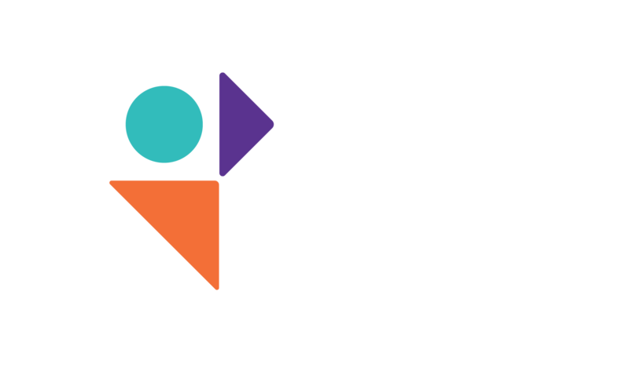

<!-- _class: title -->
<!-- _backgroundColor: #0b2f6b -->
<!-- _color: #ffffff -->



# VIB Nucleomics Core
## Project Manager

<br>

**A Minimalist LIMS for Sequencing Core Operations**

Stéphane Plaisance (+AI) · VIB Nucleomics Core Facility · Leuven, Belgium · 2026

---

## VIB Nucleomics Core — Who We Are

VIB Nucleomics Core is a shared next-generation sequencing facility serving academic and industry researchers across VIB and beyond.

<div class="cols">
<div class="box">

### Services
- Next-generation sequencing (Illumina NovaSeq, Element Aviti, PacBio Revio)
- Library preparation from customer DNA/RNA
- Bioinformatics support and data delivery
- Quality control at every step

</div>
<div class="box-o">

### Scale & Complexity
- Dozens of concurrent projects at different stages
- Multiple platforms, library prep methods, organisms
- Strict QC requirements at each pipeline step
- Billing via CoreConnect (VIB institutional system)
- Full sample-to-result traceability expected

</div>
</div>

---

## The Challenge: Managing a Multi-Step Sequencing Workflow

<div class="cols">
<div class="lab">

### The Manual Workflow
1. Customer submits sample requirement **Excel**
2. Samples received and measured (Bioanalyzer, Qubit)
3. Libraries prepared in wet lab
4. Libraries pooled and QC-checked
5. Sequencing run scheduled on instrument
6. Data processed and delivered

At each step: documents generated, volumes consumed, status changes.

**Tracking this across spreadsheets and emails is fragile.**

</div>
<div class="box-y">

### Pain Points Without a LIMS
- Which step is project #5156 at right now?
- How much sample volume is left for KO_VEH_1?
- Where is the Bioanalyzer trace for library 5156-lib1?
- Which flowcell lane carried the HiF project samples?
- Who approved the GO date for sequencing?
- What was the loading concentration on that run?

> No single source of truth → risk of errors, lost data, billing disputes.

</div>
</div>

---

## The Approach: A Minimalist LIMS

> **Digitise the existing workflow — don't replace it.**

Commercial LIMS solutions are expensive, over-engineered, and require re-training staff. The Nucleomics Core Project Manager takes a different approach:

<div class="cols3">
<div class="box">

### Preserve
- Customer Excel sample sheets as-is
- Familiar step names and terminology
- CoreConnect project/claim IDs
- Staff's existing mental model

</div>
<div class="box-o">

### Add
- Persistent relational database
- Volume tracking with QC event history
- Document storage at every step
- Complete audit trail
- Live pipeline status per project

</div>
<div class="box-g">

### Avoid
- Heavyweight infrastructure
- Vendor lock-in
- Complex configuration
- Process disruption
- Cloud dependencies

</div>
</div>

---

## System Architecture

<div class="cols">
<div>

### Technology Stack

| Layer | Technology |
|---|---|
| Backend | Python 3.11 · Flask REST API |
| Database | SQLite 3 (WAL mode, hardened) |
| Frontend | HTML · JavaScript (no framework) |
| Auth | bcrypt · server-side sessions |
| Deployment | Docker · Gunicorn · colima (macOS) |
| Data storage | Disk-based files · NAS-mountable |

### Deployment
- Single Docker image, 12-second rebuild
- `DATA_DIR` bind-mount → SQLite file + attachments
- Separate backup volume with hot-backup script
- Port 11002 · zero cloud dependency

</div>
<div class="box">

### Key Design Principles

✅ **Self-contained** — one SQLite file, one process

✅ **Portable** — Docker image, NAS-mountable data

✅ **Auditable** — every action timestamped and logged

✅ **Traceable** — hard FK chain Sample → Run

✅ **Documented** — QC files attached at each step

✅ **Minimal** — 272 tests, no unnecessary complexity

✅ **Resilient** — WAL crash safety + scheduled backups

</div>
</div>

---

## The 9-Step Pipeline

Each project passes through 9 tracked steps. The **Project Detail** page shows a live colour-coded status bar.

<div class="cols">
<div>

| # | Step | Lab Action |
|---|---|---|
| 1 | **Samplesheet** | Upload customer Excel → parse samples |
| 2 | **Samples** | Individual sample records + QC metrics |
| 3 | **Sample QC** | Bioanalyzer / Qubit — volume deducted |
| 4 | **Libraries** | Library preparation — samples consumed |
| 5 | **Library QC** | Size + concentration check |
| 6 | **Pools** | Equimolar pooling of libraries |
| 7 | **Pool QC** | Final QC before loading |
| 8 | **Runs** | Sequencing run on instrument |
| 9 | **Run QC** | Post-run metrics + results attached |

</div>
<div>


</div>
</div>

---

## Database Entity Hierarchy

<div class="chain">

PROJECTS  ──────────────────────────────────────────────────────────┐
  │  ProjectID · QuoteNumber · CoreConnect ref · Staff · Dates      │
  │                                                                  │
  ├── SAMPLESHEETS  (FK → PROJECTS)                                 │
  │     │  Excel upload · Status · SampleCount                      │
  │     │                                                            │
  │     ├── SAMPLES  (FK → SAMPLESHEETS)                            │
  │     │     │  Name · Conc · Volume · CurrentVolume · Barcodes    │
  │     │     └── LIBRARY_SAMPLES  ──────► LIBRARIES                │
  │     │                                                            │
  │     ├── SAMPLE_QC_EVENTS  (volume deductions)                   │
  │     │     └── SAMPLE_QC_DOCUMENTS  (Bioanalyzer, Qubit…)        │
  │     └── PROJECT_DOCUMENTS  (quotes, contracts, reports)         │
  │                                                                  │
  ├── LIBRARIES  (multi-samplesheet, multi-project)                 │
  │     │  PrepMethod · Status (planned/produced/failed)            │
  │     ├── LIBRARY_QC_DOCUMENTS                                    │
  │     └── POOL_LIBRARIES  ──────────────► POOLS                   │
  │                                                                  │
  ├── POOLS  (equimolar mix of libraries)                           │
  │     ├── POOL_QC_DOCUMENTS                                       │
  │     └── RUN_POOLS  (lane assignments) ──► RUNS                  │
  │                                                                  │
  └── RUNS  (sequencer · flowcell · read config · status)           │
        └── RUN_DOCUMENTS · RUN_QC                                  │
                                                                    │
ACTIONS  (complete audit log — every event) ────────────────────────┘

</div>

---

## Login & Access Control

<div class="cols">
<div class="box">

### Lab Context
Staff access the system from any browser — no installation needed. Roles restrict access:

| Role | Permissions |
|---|---|
| **Admin** | Full access + user management |
| **Staff** | All project operations |
| **Read-only** | View projects and data |

- Sessions persist across browser refresh
- Password change triggers email confirmation
- bcrypt hashing — no plaintext passwords stored
- "Remember me" option for persistent sessions

</div>
<div>


</div>
</div>

---

## Step 1 · Projects Dashboard

<div class="cols">
<div class="lab">

### Lab Step
Projects arrive from **CoreConnect** (VIB institutional ordering) or are created manually. Each project = one customer sequencing request.

Fields captured:
- Experiment name · Platform · Organism
- Wet lab scientist · Project leader
- Quote number · CoreConnect project/claim IDs
- Key dates: GO, Run, QC delivery, Results delivery
- Status tracking: In Progress / Completed

**Filters**: All · Completed · In Progress · "Worked on" date range

**Export**: Full table to Excel in one click

</div>
<div>


</div>
</div>

---

## Step 2 · Project Detail & Pipeline Tracker

<div class="cols">
<div class="app">

### App Page: Project Detail
Central hub for each project.

**Pipeline progress bar** — 9 colour-coded steps:
- Green = committed (data present or force-confirmed)
- Red = explicitly rejected / failed
- Grey = not yet started

Each step is clickable → navigates directly to the relevant data.

**Excel Info Panel** — metadata imported from the customer's Sample Requirement Excel: name, email, department, quote number, billing address.

**Quick links** to all related samplesheets, libraries, pools and runs.

</div>
<div>


</div>
</div>

---

## Step 3 · Samplesheet & Sample Receipt

<div class="cols">
<div>

**Samplesheets list** — one row per uploaded Excel, with quick links to view samples, create a library, download the file, or delete.


</div>
<div>

**Samplesheet detail** — sample table (conc, volume, barcodes) and QC section below.


</div>
</div>

When the customer Excel is uploaded: samples parsed automatically, initial volume recorded, file auto-attached as a QC document. Status: `pending → received → processed`. Every sample is permanently linked to its samplesheet and project via foreign keys.

---

## Step 4 · Sample QC — Volume Tracking

<div class="cols">
<div class="app">

### App Page: Samplesheet Detail (QC section)
Before library preparation, samples are measured. Each measurement **deducts volume** from all samples in the samplesheet.

**QC Events** record:
- Date of measurement
- Volume taken per sample (µL)
- Staff member + timestamp
- Optional notes

**QC Documents** attach measurement files:
- Bioanalyzer traces (PDF / XML)
- Qubit CSV exports
- Gel images

`CurrentVolume` updates automatically on every event. Deleting an event **restores** the volume — fully reversible.

</div>
<div>


</div>
</div>

Documents are linked either globally to the samplesheet or to a specific QC event.
The auto-attached Excel file and any uploaded Bioanalyzer / Qubit reports appear in the QC Documents table below.

---

## Step 5 · Library Preparation

<div class="cols">
<div class="lab">

### Lab Step
Libraries are created from one or more samplesheets. **Cross-project pooling** is supported — multiple customers' samples can be combined in one library.

**Library record** captures:
- Preparation kit / method (from reference table)
- Status: `planned → produced → failed`
- Creation date and responsible staff
- Notes

**Library Samples** table = key traceability link:
- Which samples contributed to this library
- How much volume was consumed from each
- Forward + reverse barcodes assigned

Download CSV of sample table for instrument setup.

</div>
<div>


</div>
</div>

---

## Step 6 · Library QC

<div class="cols">
<div class="app">

### App Page: Library Detail (QC section)
After preparation, each library is quality-checked:

- Fragment size distribution (Bioanalyzer / TapeStation)
- Library concentration (Qubit / qPCR)

**Library QC Documents** are attached directly:
- Gel images, trace files (PDF/XML)
- qPCR sheets, concentration CSV

Staff can **Mark as Failed** → pipeline step turns red → library excluded from pooling.

Libraries with status `produced` proceed to pool creation.

</div>
<div>


</div>
</div>

---

## Step 7 · Pooling

<div class="cols">
<div class="lab">

### Lab Step
Libraries are combined into a **pool** for loading onto the sequencer. The current implementation tracks:

- Which libraries are included in the pool
- Overall pool volume (µL) and concentration (nM)
- Status: `active → used → archived`

**POOL_LIBRARIES** junction records which libraries are in each pool. Per-library volumes, ratios, and PhiX fractions are stored in the schema but **not yet exposed in the UI** — individual loading proportions are a planned future feature.

**Pool QC documents** attach:
- Post-pooling Bioanalyzer traces
- Dilution calculation sheets
- Final concentration measurements

Multiple pools can be assigned to different lanes of the same run.

</div>
<div>


</div>
</div>

---

## Step 8 · Sequencing Run

<div class="cols">
<div class="lab">

### Lab Step
A **Run** represents one physical instrument run. Recorded information:

- Sequencer ID (from reference table)
- Flowcell ID, type, slot number
- Read configuration (2×150, 2×250…)
- Loading concentration (pM) and PhiX %
- Lanes used — one pool per lane

**Lane assignments** (RUN_POOLS) map each pool to a specific flowcell lane.

**Run status** lifecycle:
`planned → running → complete / failed / aborted`

**Run documents** attach run reports, demux stats, MultiQC.

</div>
<div>


</div>
</div>

---

## Step 9 · Run QC & Results Delivery

<div class="cols">
<div class="app">

### App Page: Run QC
After sequencing, QC metrics are edited (could later be imported via API!):

- Cluster density / PF clusters
- Q30 percentage
- Total yield (Gbp)
- Error rate · PhiX alignment

**Run QC documents** (attached) embed the full results package:
- MultiQC HTML reports
- FastQC summaries
- InterOp / SAV metric exports
- Demultiplexing statistics

Run status set to `complete` → final pipeline step turns green → project marked as delivered.

</div>
<div>


</div>
</div>

---

## Reference Tables: Instruments & Prep Methods

<div class="cols">
<div>

### Sequencers
Available instruments and their configurations — used when creating runs.


</div>
<div>

### Library Prep Methods
Reference kit catalogue — used when creating libraries. Never deleted to preserve historical integrity.


</div>
</div>

---

## Full Traceability Chain

<div class="chain">

  Customer Quote #S04-QUOTE-2026-366
      │
      ▼
  PROJECT #5156  ──  CoreConnect: S04-PROJ-2026-292 / S04-CLAIM-2026-109
  mRNA-seq project · VEK-VEK-MU41 · 12 samples · Element Aviti
      │
      ▼
  SAMPLESHEET #1  ──  ma_sample_requirements_hnRNa_project.xlsx  (12 samples)
      │  KO_VEH_1 … WT_VEH_3 · Conc 127–166 ng/µL · 10 µL received
      │  QC event: -1 µL Bioanalyzer · CurrentVolume updated
      ▼
  LIBRARY "5156 library 1"  ──  Rapid RNA Prep · status: produced
      │  12 samples × volumes consumed · barcodes assigned
      │  Library QC: size OK, 2.3 nM
      ▼
  POOL "POOL-5156 library 1"  ──  15 pM · PhiX 1%
      │  Lanes 1–4 assigned
      ▼
  RUN "Aviti-20260302-001"  ──  Aviti AV224003 · 2×150 · 15 pM loading
      │  Status: running → complete
      ▼
  RUN QC  ──  results delivered  ──  PROJECT #5156: COMPLETE ✓

</div>

> Every arrow is a **database foreign key**. No step can reference a parent that doesn't exist. The chain is structurally guaranteed.

---

## Document & Results Embedding

At every QC step, files are attached directly to the relevant entity — not stored in a separate folder system.

| Pipeline Step | Storage Entity | Typical Documents |
|---|---|---|
| Project | PROJECT_DOCUMENTS | Quotes, contracts, delivery reports, invoices |
| Sample QC | SAMPLE_QC_DOCUMENTS | Bioanalyzer PDFs, Qubit CSVs, gel images |
| Library QC | LIBRARY_QC_DOCUMENTS | Bioanalyzer traces, qPCR sheets, TapeStation |
| Pool QC | POOL_QC_DOCUMENTS | Dilution sheets, post-pool Bioanalyzer, concentration |
| Run | RUN_DOCUMENTS | Run reports, demux stats, MultiQC HTML |

<br>

<div class="cols3">
<div class="box-g">

**On disk, not in DB**
Files stored in `db/attachments/` — scalable, portable, NAS-friendly.

</div>
<div class="box">

**Original filenames preserved**
Duplicates auto-renamed (`_1`, `_2`…). Downloadable on-demand.

</div>
<div class="box-o">

**Survive restarts**
Bind-mounted volume — files persist independently of the container lifecycle.

</div>
</div>

---

## Audit Trail — Complete Action Log

<div class="cols">
<div class="box">

### What is logged?
**Every** create, update, delete, import, download, and export action is appended to the `ACTIONS` table:

- Timestamp (ISO, millisecond precision)
- Username
- Action type (colour-coded badge: create / update / delete / export / import)
- Entity type + ID (clickable link)
- Human-readable description

### Why it matters
- Reconstruct the history of any sample or project
- Identify who changed what, and when
- Support lab audits and regulatory compliance
- Non-repudiation for billing disputes
- Searchable and filterable in the UI

</div>
<div>


</div>
</div>

---

## Project Summary Export — Traceability Memo

<div class="cols">
<div class="box">

### One command → complete project history

```bash
# CLI
python scripts/project_summary.py \
    --project-id 42 --pdf

# Flask API
GET /api/projects/42/summary
GET /api/projects/42/summary?format=pdf
```

The output is a structured **Markdown memo** (or PDF via pandoc) covering every step the project passed through.

</div>
<div class="box-o">

### Document structure

```
Executive Summary  (one paragraph auto-built
  from DB: organism, platform, method, Q30, yield)
Key dates table
─────────────────────────────────────────
1. Project Details + project documents
2. Pipeline Status (9-step table)
3. Library Chain 1: LibraryName
   ├ Samplesheet → Samples table
   ├ Sample QC events + attachments
   ├ Library QC attachments (grouped by type)
   ├ Pool → Pool QC attachments
   └ Run → Run QC metrics + run documents
4. Library Chain 2 … (if applicable)
5. Unlinked Samplesheets (dead ends)
6. Audit Trail (chronological)
```

</div>
</div>

<div class="cols3" style="margin-top:0.8rem">
<div class="box-g">

**Failed steps explicit**
Failed libraries, aborted runs, libraries without pools, pools without runs — all flagged with a callout.

</div>
<div class="box">

**Attachments by type**
Every file listed under the step it belongs to, grouped by document type (NanoDrop, Bioanalyzer, Run Report…).

</div>
<div class="box-y">

**Cross-project aware**
Shared libraries/pools show other project names inline — no foreign-project detail leaked into the memo.

</div>
</div>

---

## Notifications & Security

<div class="cols">
<div class="box">

### Email Notifications
The system sends automated emails on security events:

- **Password changed** — confirmation with security warning
- **Password reset** — one-time reset link
- **New user welcome** — credentials + login instructions

Delivered via Gmail SMTP (app password, never stored in Docker image).

</div>
<div>


</div>
</div>

<div class="box-g" style="margin-top:1rem">

**Credentials are never baked into the Docker image.** Mail passwords and the Flask secret key are injected at runtime from a gitignored `.env` file on the host — keeping the image safe to share or push to a registry.

</div>

---

## Key Strengths

<div class="cols3">
<div class="box">

### Traceability
Sample → Library → Pool → Run is a **hard database chain**. You can always answer: "which run carried this sample, and at what concentration?"

</div>
<div class="box-o">

### Document-Centric
QC documents, reports, and results live **alongside the data they describe** — not in a parallel folder structure that drifts out of sync.

</div>
<div class="box-g">

### Audit-Ready
Every action logged with user, timestamp, entity, and description. The trail is searchable, filterable, and reflects the true history of every project.

</div>
</div>

<div class="cols3" style="margin-top:1rem">
<div class="box">

### Workflow-Native
Built around existing **Excel sample sheets** and CoreConnect IDs. Zero re-training. Zero process change. Staff adopt it, not fight it.

</div>
<div class="box-o">

### Low Overhead
One SQLite file. One web process. Runs on a MacBook, a lab server, or a NAS-connected Docker host. No cloud, no maintenance contract.

</div>
<div class="box-g">

### Self-Deployable
Docker image rebuilt in 12 seconds. NAS-mountable data volume. One script to redeploy a new version. Automated hot-backup with configurable retention.

</div>
</div>

---

## Deployment & Operations

<div class="cols">
<div class="box">

### One-command Rebuild
```bash
bash scripts/rebuild_docker.sh
```
- Stops old container · rebuilds image · starts new
- Pre-creates bind-mount dirs · sources `.env` for secrets
- Waits 3 s · confirms container is running + port

### Data Persistence
| Path | Contents |
|---|---|
| `./db/` | SQLite database + all attachments |
| `./backups/` | Timestamped hot backups |

Both bind-mounted → survive container deletion.
Point `DATA_DIR` at a NAS mount for production.

</div>
<div class="box-g">

### Backup Strategy
```bash
docker exec nucleomics-app bash /app/scripts/backup_data.sh
```
- SQLite **online hot backup** (WAL-safe, no downtime)
- Attachment folder rsync to `BACKUP_DIR`
- Timestamped folders: `2026-03-06_020000/`
- Auto-purge backups older than `BACKUP_RETENTION_DAYS`
- Schedulable via host cron

### Quality Assurance
- **272 automated tests** covering all API routes, edge cases, and schema constraints
- SQLite WAL mode + foreign key enforcement
- All secrets excluded from image via `.dockerignore`

</div>
</div>

---

## Discussion & Potential Extensions

### What the system does today

✅ Full 9-step project lifecycle tracking with live pipeline status
✅ Sample volume tracking with reversible QC event history
✅ Cross-project and cross-samplesheet library creation
✅ Library pooling with per-lane sequencer run assignments (per-library loading proportions: planned)
✅ Document / results attachment at every pipeline level
✅ Complete, searchable audit trail with user attribution
✅ Role-based access control with email security notifications
✅ Docker deployment with NAS-mountable data and automated backup
✅ Project Summary Export — full traceability memo (Markdown / PDF) per project, grouped by library chain with all QC events, attachments, and audit trail

### Potential Extensions

| Extension | Value |
|---|---|
| Per-library pooling proportions (volume, ratio, PhiX%) in UI | Precise equimolar loading records |
| Customer-facing portal (read-only project status) | Reduce status-inquiry emails |
| CoreConnect API import | Eliminate manual project creation |
| Email alerts on pipeline step completion | Proactive staff notifications |
| Bioinformatics pipeline trigger on run completion | End-to-end automation |
| ELN / electronic lab notebook export | Institutional data management integration |

---

<!-- _class: title -->
<!-- _backgroundColor: #0b2f6b -->
<!-- _color: #ffffff -->


## Summary

<br>

> The VIB Nucleomics Core **Project Manager** is a purpose-built, minimalist LIMS that digitises the facility's existing sequencing workflow — without disrupting it.

<br>

**From customer quote to delivered dataset — every step tracked, every document stored, every action logged.**

<br>

<div class="cols3">
<div class="center box" style="background:rgba(255,255,255,0.94);border-color:#f0c890;color:#12305f">

**272 automated tests**
Reliability you can verify

</div>
<div class="center box" style="background:rgba(255,255,255,0.94);border-color:#f0c890;color:#12305f">

**9 pipeline steps**
Complete workflow coverage

</div>
<div class="center box" style="background:rgba(255,255,255,0.94);border-color:#f0c890;color:#12305f">

**1 SQLite file**
Simple · portable · fast

</div>
</div>

<br>

<div class="cols3">
<div class="center box" style="background:rgba(255,255,255,0.94);border-color:#f0c890;color:#12305f">

**Project Summary memo**
Full traceability in one PDF

</div>
<div class="center box" style="background:rgba(255,255,255,0.94);border-color:#f0c890;color:#12305f">

**23 DB tables**
Every pipeline entity modelled

</div>
<div class="center box" style="background:rgba(255,255,255,0.94);border-color:#f0c890;color:#12305f">

**5 attachment tiers**
Docs at every QC step

</div>
</div>

<br>

*Stéphane Plaisance (+AI) · VIB Nucleomics Core Facility · Leuven, Belgium · 2026*
